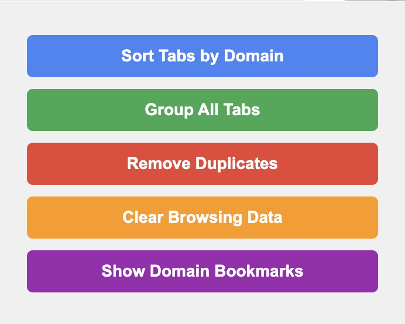

# Chrome Tab Organizer

Chrome Tab Organizer is a browser extension that helps you manage your tabs more efficiently. It provides several features to organize, group, and clean up your tabs.

## Features

1. **Sort Tabs by Domain**: Automatically groups tabs from the same website into one tab group.
2. **Group All Tabs**: Allows you to group all open tabs into a single group with a custom name.
3. **Remove Duplicates**: Identifies and offers to close duplicate tabs from the same domain.
4. **Clear Browsing Data**: Clears browsing data for the current tab's domain.
5. **Show Domain Bookmarks**: Displays all bookmarks related to the current tab's domain.

## How to Use

1. Click on the extension icon in your Chrome browser to open the popup.
2. Use the buttons in the popup to perform various tab management actions:
   - "Sort Tabs by Domain" to group tabs from the same website.
   - "Group All Tabs" to create a single group for all open tabs.
   - "Remove Duplicates" to identify and close duplicate tabs.
   - "Clear Browsing Data" to clear data for the current domain.
   - "Show Domain Bookmarks" to view bookmarks related to the current domain.

## Demo

The image above shows the extension popup with all available actions, including the new "Show Domain Bookmarks" feature.

## Installation

1. Clone this repository or download the source code.
2. Open Chrome and go to `chrome://extensions/`.
3. Enable "Developer mode" in the top right corner.
4. Click "Load unpacked" and select the directory containing the extension files.

## Permissions

This extension requires the following permissions:

- `tabs`: To access and manipulate browser tabs.
- `tabGroups`: To create and manage tab groups.
- `browsingData`: To clear browsing data for specific domains.
- `bookmarks`: To access and display bookmarks for specific domains.

These permissions are necessary for the extension to function properly and provide its features.

## Contributing

Contributions are welcome! Please feel free to submit a Pull Request.

## License

This project is open source and available under the [MIT License](LICENSE).